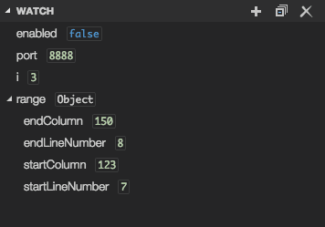

# 调试

Visual Studio Code的主要特点之一是它对调试的支持。VS Code的内置调试器有助于加速你的编辑、编译和调试。


## 调试器扩展

VS Code对Node.js runtime有内置的调试支持，可以调试JavaScript、TypeScript或任何其他被转译为JavaScript的语言。

对于调试其他语言和运行时（包括PHP、Ruby、Go、C#、Python、C++、PowerShell和许多其他语言），请在VS Code Marketplace中寻找调试器扩展，或在顶级运行菜单中选择安装其他调试器。

下面是几个支持调试的流行扩展：

<!-- <div class="marketplace-extensions-debuggers"></div> -->


> Tip: 上面展示的多个扩展不必全部选择。选择上面的扩展前，阅读它的描述和评论决定那个扩展最适合你。

## 开始调试

下面的文档是基于内置的Node.js调试器，但大多数概念和功能也适用于其他调试器。

在阅读调试内容之前，先创建一个Node.js 应用程序是有帮助的。你可以按照Node.js的文档来安装Node.js并创建一个简单的 "Hello World "JavaScript应用程序（app.js）。一旦你建立了一个简单的应用程序，这个页面将带领你了解VS Code的调试功能。

## 运行和调试视图

要调出运行和调试视图，请在VS Code侧面的活动栏中选择运行和调试图标。你也可以使用键盘上的快捷键 ⇧ ⌘D。


" 运行和调试 "视图显示与运行和调试有关的所有信息，并有一个带有调试命令和配置设置的顶栏。

如果运行和调试还没有配置（没有创建 launch.json），VS Code会显示运行开始视图。


## 运行菜单

顶层的运行菜单有最常用的运行和调试命令。


## 实施配置

要在VS Code中运行或调试一个简单的应用程序，在调试开始视图中选择运行和调试，或者按F5，VS Code将尝试运行你当前的活动文件。

对于大多数调试场景，创建一个启动配置文件是有益的，因为它允许你配置和保存调试设置细节。VS Code 将调试配置信息保存在 launch.json 文件中，该文件位于工作区（项目根目录）的 .vscode 文件夹中，或者在用户设置或工作区设置中。

要创建 launch.json 文件，请点击运行开始视图中的创建 launch.json 文件链接。


VS Code会尝试自动检测你的调试环境，但如果失败了，你将不得不手动选择它。


这里是为Node.js调试生成的启动配置:

```json
{
    "version": "0.2.0",
    "configurations": [
        {
            "type": "node",
            "request": "launch",
            "name": "Launch Program",
            "skipFiles": [
                "<node_internals>/**"
            ],
            "program": "${workspaceFolder}\\app.js"
        }
    ]
}
```

如果你回到文件资源管理器视图（⇧ ⌘E），你会看到VS Code已经创建了一个.vscode文件夹，并将launch.json文件添加到你的工作区。


>**Note**: 即使你在VS Code中没有打开文件夹，你也可以调试一个简单的应用程序，但不可能管理启动配置和设置高级调试。如果你没有打开一个文件夹，VS Code的状态栏是紫色的。

注意，启动配置中可用的属性因调试器而异。你可以使用IntelliSense建议（⌃Space）来查找特定调试器存在哪些属性.悬停帮助也适用于所有属性。

不要假定对于一个调试器可用的属性会自动适配其他调试器。如果你在启动配置中看到了绿色的斜线，请将鼠标悬停在上面，了解问题所在，并且在启动调试前修复它们。


检查所有自动生成的值并且确保它们对你的项目和调试环境有意义。

### 启动和附加

在VS Code中，有两种核心的调试模式，启动和附加，它们处理两种不同的工作流程和开发人员的细分。根据你的工作流程，要知道哪种类型的配置适合你的项目，可能会很困惑。

如果你有着浏览器开发背景，你可能不习惯于“从工具中启动”，因为你的浏览器已经是打开状态。当你打开DevTools时，你只是把DevTools附加到你打开的浏览器标签上.另一方面，如果你有着服务器或桌面应用开发背景。让你的编辑器为你启动一个进程是正常的，并且它自动将其调试器附加到新启动的进程上

解释"启动" 和 "附加"不同点的最好放方式是：
    启动：在以调试模式启动你的应用前，把vsCode附加上去
    附加：把vsCode调试器连接到已经运行的应用和进程

VS Code调试器通常支持在调试模式下启动一个程序或在调试模式下附加到一个已经运行的程序。根据不同的请求（附加或启动），需要不同的属性，VS Code的 launch.json 验证和建议应该可以帮助解决这个问题。

### 增加一个新的配置

要向现有的 launch.json 添加新的配置，请使用以下技术之一。:

* 如果你的光标位于配置数组内，请使用IntelliSense。.
* 按下 "添加配置 "按钮，在数组的开始部分调用片段IntelliSense。.
* 在运行菜单中选择添加配置选项.


vsCode还支持复合启动配置，用于同时启动多个配置；更多细节，请阅读本节.

为了启动调试会话，首先使用运行和调试视图中的配置下拉菜单选择名为启动程序的配置。一旦你设置了你的启动配置，用F5启动你的调试会话。

另外，你也可以通过命令面板（⇧ ⌘P）在Debug上过滤来运行你的配置。选择并开始调试，或者输入'debug'并选择你要调试的配置。

一旦调试会话开始，DEBUG CONSOLE面板就会显示，并显示调试输出，状态栏也会改变颜色（默认颜色主题为橙色）。


此外，调试状态出现在状态栏中，显示活动的调试配置。通过选择调试状态，用户可以改变活动的启动配置并开始调试，而不需要打开运行和调试视图。


## 调试操作

一旦调试会话开始，调试工具条就会出现在编辑器的顶部。


| Action                                                 | Explanation                                                                                                                                                            |
|--------------------------------------------------------|--------------------------------------------------------------------------------------------------------------------------------------------------------------------|
| Continue / Pause <br> `kb(workbench.action.debug.continue)` | **Continue**: Resume normal program/script execution (up to the next breakpoint). <br> **Pause**: Inspect code executing at the current line and debug line-by-line.     |
| Step Over <br> `kb(workbench.action.debug.stepOver)`        | Execute the next method as a single command without inspecting or following its component steps.                                                                    |
| Step Into <br> `kb(workbench.action.debug.stepInto)`        | Enter the next method to follow its execution line-by-line.                                                                                                         |
| Step Out <br> `kb(workbench.action.debug.stepOut)`          | When inside a method or subroutine, return to the earlier execution context by completing remaining lines of the current method as though it were a single command. |
| Restart <br> `kb(workbench.action.debug.restart)`           | Terminate the current program execution and start debugging again using the current run configuration.                                                             |
| Stop <br> `kb(workbench.action.debug.stop)`                 | Terminate the current program execution.                                                                                                                            |

>**Tip**: 使用设置 debug.toolBarLocation 来控制调试工具条的位置。它可以是默认的浮动，停靠在运行和调试视图上，或者隐藏。浮动的调试工具条可以水平拖动，也可以向下拖动到编辑区。

### 运行模式

除了调试程序外，VS Code还支持运行程序。Debug:运行（不调试开始）动作由⌃F5触发，并使用当前选择的启动配置。许多启动配置的属性在 "运行 "模式下都支持。VS Code在程序运行时保持一个调试会话，按 "停止 "按钮可以终止程序。

>**Tip**: 运行 "动作总是可用的，但不是所有的调试器扩展都支持 "运行"。在这种情况下，'运行'将与'调试'相同。

## 断点

断点可以通过点击编辑器边缘或在当前行上使用F9进行切换。更精细的断点控制（启用/禁用/重新应用）可以在运行和调试视图的BREAKPOINTS部分完成

* 编辑器边缘的断点通常显示为红色填充圆圈。
* 被禁用的断点有一个填充的灰色圆圈。
* 当调试会话开始时，不能被调试器注册的断点会变成灰色的空心圆圈。如果在没有实时编辑支持的调试会话运行时编辑源代码，也可能发生同样的情况。

如果调试器支持对不同类型的错误或异常进行中断，这些也会在BREAKPOINTS视图中出现。

Reapply All Breakpoints（重新应用所有断点）命令将所有断点重新设置到原来的位置。如果你的调试环境很 "懒"，把断点 "错放在 "尚未执行的源代码中，这就很有帮助。


通过启用设置debug.showBreakpointsInOverviewRuler，断点可以选择性地显示在编辑器的概览标尺上。


## 日志点

日志点是断点的一种变体，它不会使调试器中断，而是将一条信息记录到控制台。在调试不能暂停或停止的生产服务器时，日志点对注入日志特别有用。

一个日志点由一个 "钻石 "形状的图标表示。日志信息是纯文本，但可以包括大括号（'{}'）内要评估的表达式。


就像普通的断点一样，日志点可以被启用或禁用，也可以通过条件和/或点击数来控制。

**Note**: VS Code内置的Node.js调试器支持Logpoints，但也可以由其他调试扩展实现。例如，Python和Java扩展就支持Logpoints。

## 数据检查

变量可以在 "运行和调试 "视图的 "变量 "部分进行检查，或者在编辑器中悬停在它们的源头。变量值和表达式的评估是相对于CALL STACK部分中选定的堆栈帧而言的。


变量的值可以通过变量的上下文菜单中的设置值动作来修改。此外，你可以使用复制值动作来复制变量的值，或复制为表达式动作来复制表达式来访问该变量。

变量和表达式也可以在运行和调试视图的WATCH部分进行评估和观察。



当焦点在VARIABLES部分时，可以通过键入来过滤变量的名称和值。


## Launch.json 属性

为了帮助支持不同的调试器和调试场景，有许多 launch.json 属性。如上所述，当你开始了一种语言类型的调试，你可以使用IntelliSense（⌃Space）来查看可用属性的列表。


以下属性对每个启动配置都是强制性的

* `type` - 调试器的类型。每个已安装的调试扩展都会引入一个类型：例如，Node用于内置的Node调试器，或者php和go用于PHP和Go扩展。.
* `request` - 请求类型, 当前支持 "启动" 和 "附加"
* `name` - 在调试启动配置下拉菜单中出现的方便读者的名称.

下面是一些可用于所有配置的可选属性。

* `presentation` - using the `order`, `group`, and `hidden` attributes in the `presentation` object, you can sort, group, and hide configurations and compounds in the Debug configuration dropdown and in the Debug quick pick.
* `preLaunchTask` - to launch a task before the start of a debug session, set this attribute to the label of a task specified in [tasks.json](/docs/editor/tasks.md) (in the workspace's `.vscode` folder). Or, this can be set to `${defaultBuildTask}` to use your default build task.
* `postDebugTask` - to launch a task at the very end of a debug session, set this attribute to the name of a task specified in [tasks.json](/docs/editor/tasks.md) (in the workspace's `.vscode` folder).
* `internalConsoleOptions` - this attribute controls the visibility of the Debug Console panel during a debugging session.
* `debugServer` - **for debug extension authors only**: this attribute allows you to connect to a specified port instead of launching the debug adapter.
* `serverReadyAction` - if you want to open a URL in a web browser whenever the program under debugging outputs a specific message to the debug console or integrated terminal. For details see section [Automatically open a URI when debugging a server program](#automatically-open-a-uri-when-debugging-a-server-program) below.

Many debuggers support some of the following attributes:

* `program` - executable or file to run when launching the debugger
* `args` - arguments passed to the program to debug
* `env` - environment variables (the value `null` can be used to "undefine" a variable)
* `envFile` - path to dotenv file with environment variables
* `cwd` - current working directory for finding dependencies and other files
* `port` - port when attaching to a running process
* `stopOnEntry` - break immediately when the program launches
* `console` - what kind of console to use, for example, `internalConsole`, `integratedTerminal`, or `externalTerminal`

## Variable substitution

VS Code makes commonly used paths and other values available as variables and supports variable substitution inside strings in `launch.json`. This means that you do not have to use absolute paths in debug configurations. For example, `${workspaceFolder}` gives the root path of a workspace folder, `${file}` the file open in the active editor, and `${env:Name}` the environment variable 'Name'. You can see a full list of predefined variables in the [Variables Reference](/docs/editor/variables-reference.md) or by invoking IntelliSense inside the `launch.json` string attributes.

```json
{
    "type": "node",
    "request": "launch",
    "name": "Launch Program",
    "program": "${workspaceFolder}/app.js",
    "cwd": "${workspaceFolder}",
    "args": [ "${env:USERNAME}" ]
}
```

## Platform-specific properties

`Launch.json` supports defining values (for example, arguments to be passed to the program) that depend on the operating system where the debugger is running. To do so, put a platform-specific literal into the `launch.json` file and specify the corresponding properties inside that literal.

Below is an example that passes `"args"` to the program differently on Windows:

```json
{
    "version": "0.2.0",
    "configurations": [
        {
            "type": "node",
            "request": "launch",
            "name": "Launch Program",
            "program": "${workspaceFolder}/node_modules/gulp/bin/gulpfile.js",
            "args": ["myFolder/path/app.js"],
            "windows": {
                "args": ["myFolder\\path\\app.js"]
            }
        }
    ]
}
```

Valid operating properties are `"windows"` for Windows, `"linux"` for Linux, and `"osx"` for macOS. Properties defined in an operating system specific scope override properties defined in the global scope.

Please note that the `type` property cannot be placed inside a platform-specific section, because `type` indirectly determines the platform in remote debugging scenarios, and that would result in a cyclic dependency.

In the example below, debugging the program always **stops on entry** except on macOS:

```json
{
    "version": "0.2.0",
    "configurations": [
        {
            "type": "node",
            "request": "launch",
            "name": "Launch Program",
            "program": "${workspaceFolder}/node_modules/gulp/bin/gulpfile.js",
            "stopOnEntry": true,
            "osx": {
                "stopOnEntry": false
            }
        }
    ]
}
```

## Global launch configuration

VS Code supports adding a `"launch"` object inside your User [settings](/docs/getstarted/settings.md). This `"launch"` configuration will then be shared across your workspaces. For example:

```json
"launch": {
    "version": "0.2.0",
    "configurations": [{
        "type": "node",
        "request": "launch",
        "name": "Launch Program",
        "program": "${file}"
    }]
}
```

## Advanced breakpoint topics

### Conditional breakpoints

A powerful VS Code debugging feature is the ability to set conditions based on expressions, hit counts, or a combination of both.

* **Expression condition**: The breakpoint will be hit whenever the expression evaluates to `true`.
* **Hit count**: The 'hit count' controls how many times a breakpoint needs to be hit before it will 'break' execution. Whether a 'hit count' is respected and the exact syntax of the expression vary among debugger extensions.

You can add a condition and/or hit count when creating a source breakpoint (with the **Add Conditional Breakpoint** action) or when modifying an existing one (with the **Edit Condition** action). In both cases, an inline text box with a dropdown menu opens where you can enter expressions:


Condition and hit count editing support is also supported for **function** and **exception** breakpoints.
You can initiate condition editing from the context menu or the new inline **Edit Condition** action.

An example of condition editing in the **BREAKPOINTS** view:


If a debugger does not support conditional breakpoints, the **Add Conditional Breakpoint** and **Edit Condition** actions will be missing.

### Inline breakpoints

Inline breakpoints will only be hit when the execution reaches the column associated with the inline breakpoint. This is particularly useful when debugging minified code which contains multiple statements in a single line.

An inline breakpoint can be set using `kb(editor.debug.action.toggleInlineBreakpoint)` or through the context menu during a debug session. Inline breakpoints are shown inline in the editor.

Inline breakpoints can also have conditions. Editing multiple breakpoints on a line is possible through the context menu in the editor's left margin.

### Function breakpoints

Instead of placing breakpoints directly in source code, a debugger can support creating breakpoints by specifying a function name. This is useful in situations where source is not available but a function name is known.

A function breakpoint is created by pressing the **+** button in the **BREAKPOINTS** section header and entering the function name. Function breakpoints are shown with a red triangle in the **BREAKPOINTS** section.

### Data breakpoints

If a debugger supports data breakpoints, they can be set from the **VARIABLES** view and will get hit when the value of the underlying variable changes. Data breakpoints are shown with a red hexagon in the **BREAKPOINTS** section.

## Debug Console REPL

Expressions can be evaluated with the **Debug Console** REPL ([Read-Eval-Print Loop](https://en.wikipedia.org/wiki/Read–eval–print_loop)) feature. To open the Debug Console, use the **Debug Console** action at the top of the Debug pane or use the **View: Debug Console** command (`kb(workbench.debug.action.toggleRepl)`). Expressions are evaluated after you press `kbstyle(Enter)` and the Debug Console REPL shows suggestions as you type. If you need to enter multiple lines, use `kbstyle(Shift+Enter)` between the lines and then send all lines for evaluation with `kbstyle(Enter)`.
Debug Console input uses the mode of the active editor, which means that the Debug Console input supports syntax coloring, indentation, auto closing of quotes, and other language features.


**Note**: You must be in a running debug session to use the Debug Console REPL.

## Redirect input/output to/from the debug target

Redirecting input/output is debugger/runtime specific, so VS Code does not have a built-in solution that works for all debuggers.

Here are two approaches you might want to consider:

1. Launch the program to debug ("debug target") manually in a terminal or command prompt and redirect input/output as needed. Make sure to pass the appropriate command line options to the debug target so that a debugger can attach to it. Create and run an "attach" debug configuration that attaches to the debug target.

2. If the debugger extension you are using can run the debug target in VS Code's Integrated Terminal (or an external terminal), you can try to pass the shell redirect syntax (for example, "<" or ">") as arguments.

Here's an example `launch.json` configuration:

```json
{
    "name": "launch program that reads a file from stdin",
    "type": "node",
    "request": "launch",
    "program": "program.js",
    "console": "integratedTerminal",
    "args": [
        "<",
        "in.txt"
    ]
}
```

This approach requires that the "<" syntax is passed through the debugger extension and ends up unmodified in the Integrated Terminal.

## Multi-target debugging

For complex scenarios involving more than one process (for example, a client and a server), VS Code supports multi-target debugging.

Using multi-target debugging is simple: after you've started a first debug session, you can just launch another session. As soon as a second session is up and running, the VS Code UI switches to _multi-target mode_:

* The individual sessions now show up as top-level elements in the **CALL STACK** view.<BR>
* The debug toolbar shows the currently **active session** (and all other sessions are available in a dropdown menu).<BR>
* Debug actions (for example, all actions in the debug toolbar) are performed on the active session. The active session can be changed either by using the dropdown menu in the debug toolbar or by selecting a different element in the **CALL STACK** view.

### Compound launch configurations

An alternative way to start multiple debug sessions is by using a **compound** launch configuration. A compound launch configuration lists the names of two or more launch configurations that should be launched in parallel. Optionally a `preLaunchTask` can be specified that is run before the individual debug sessions are started. The boolean flag `stopAll` controls whether manually terminating one session will stop all of the compound sessions.

```json
{
    "version": "0.2.0",
    "configurations": [
        {
            "type": "node",
            "request": "launch",
            "name": "Server",
            "program": "${workspaceFolder}/server.js"
        },
        {
            "type": "node",
            "request": "launch",
            "name": "Client",
            "program": "${workspaceFolder}/client.js"
        }
    ],
    "compounds": [
        {
            "name": "Server/Client",
            "configurations": ["Server", "Client"],
            "preLaunchTask": "${defaultBuildTask}",
            "stopAll": true
        }
    ]
}
```

Compound launch configurations are displayed in the launch configuration dropdown menu.

## Remote debugging

VS Code does not itself support remote debugging: this is a feature of the debug extension you are using, and you should consult the extension's page in the [Marketplace](https://marketplace.visualstudio.com/search?target=VSCode&category=Debuggers&sortBy=Installs) for support and details.

There is, however, one exception: the Node.js debugger included in VS Code supports remote debugging. See the [Node.js Debugging](/docs/nodejs/nodejs-debugging.md#remote-debugging) topic to learn how to configure this.

## Automatically open a URI when debugging a server program

Developing a web program typically requires opening a specific URL in a web browser in order to hit the server code in the debugger. VS Code has a built-in feature "**serverReadyAction**" to automate this task.

Here is an example of a simple [Node.js Express](https://expressjs.com) application:

```javascript
var express = require('express');
var app = express();

app.get('/', function (req, res) {
  res.send('Hello World!')
});

app.listen(3000, function () {
  console.log('Example app listening on port 3000!')
});
```

This application first installs a "Hello World" handler for the "/" URL and then starts to listen for HTTP connections on port 3000. The port is announced in the Debug Console, and typically, the developer would now type `http://localhost:3000` into their browser application.

The **serverReadyAction** feature makes it possible to add a structured property `serverReadyAction` to any launch config and select an "action" to be performed:

```json
{
  "type": "node",
  "request": "launch",
  "name": "Launch Program",
  "program": "${workspaceFolder}/app.js",

  "serverReadyAction": {
    "pattern": "listening on port ([0-9]+)",
    "uriFormat": "http://localhost:%s",
    "action": "openExternally"
  }
}
```

Here the `pattern` property describes the regular expression for matching the program's output string that announces the port. The pattern for the port number is put into parenthesis so that it is available as a regular expression capture group. In this example, we are extracting only the port number, but it is also possible to extract a full URI.

The `uriFormat` property describes how the port number is turned into a URI. The first `%s` is substituted by the first capture group of the matching pattern.

The resulting URI is then opened outside of VS Code ("externally") with the standard application configured for the URI's scheme.

### Trigger Debugging via Edge or Chrome

Alternatively, the `action` can be set to `debugWithEdge` or `debugWithChrome`. In this mode, a `webRoot` property can be added that is passed to the Chrome or Edge debug session.

To simplify things a bit, most properties are optional and we use the following fallback values:

* **pattern**: `"listening on.* (https?://\\S+|[0-9]+)"` which matches the commonly used messages "listening on port 3000" or "Now listening on: https://localhost:5001".
* **uriFormat**: `"http://localhost:%s"`
* **webRoot**: `"${workspaceFolder}"`

### Triggering an Arbitrary Launch Config

In some cases, you may need to configure additional options for the browser debug session--or use a different debugger entirely. You can do this by setting `action` to `startDebugging` with a `name` property set to the name of the launch configuration to start when the `pattern` is matched.

The named launch configuration must be in the same file or folder as the one with the `serverReadyAction`.

Here the **serverReadyAction** feature in action:


## Next steps

To learn about VS Code's Node.js debugging support, take a look at:

* [Node.js](/docs/nodejs/nodejs-debugging.md) - Describes the Node.js debugger, which is included in VS Code.
* [TypeScript](/docs/typescript/typescript-debugging.md) - The Node.js debugger also supports TypeScript debugging.

To see tutorials on the basics of Node.js debugging, check out these videos:

* [Intro Video - Debugging](/docs/introvideos/debugging.md) - Showcases the basics of debugging.
* [Getting started with Node.js debugging](https://www.youtube.com/watch?v=2oFKNL7vYV8) - Shows how to attach a debugger to a running Node.js process.

To learn about debugging support for other programming languages via VS Code extensions:

* [C++](/docs/cpp/cpp-debug.md)
* [Python](/docs/python/debugging.md)
* [Java](/docs/java/java-debugging.md)

To learn about VS Code's task running support, go to:

* [Tasks](/docs/editor/tasks.md) - Describes how to run tasks with Gulp, Grunt, and Jake and how to show errors and warnings.

To write your own debugger extension, visit:

* [Debugger Extension](/api/extension-guides/debugger-extension.md) - Uses a mock sample to illustrate the steps required to create a VS Code debug extension.

## Common questions

### What are the supported debugging scenarios?

Debugging of Node.js-based applications is supported on Linux, macOS, and Windows out of the box with VS Code. Many other scenarios are supported by [VS Code extensions](https://marketplace.visualstudio.com/vscode/Debuggers?sortBy=Installs) available in the Marketplace.

### I do not see any launch configurations in the Run and Debug view dropdown. What is wrong?

The most common problem is that you did not set up `launch.json` or there is a syntax error in that file. Alternatively, you might need to open a folder, since no-folder debugging does not support launch configurations.
